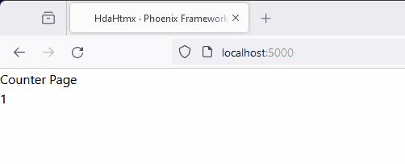
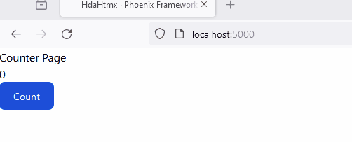
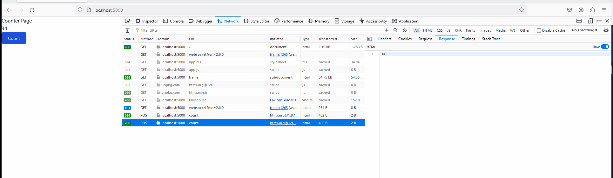

# Step 1 : Into HTMX

The first step basically create a simple web server(using Phoenix Framework), displaying a home page and later integrated with HTMX.

- The First task display a count that represent how many times the page has been requested.


## Define a Counter

First we will need to have something to implement a counter, and for this particular case we will use an [Elixir Agent](https://hexdocs.pm/elixir/1.12.3/Agent.html)

Copy the following in the folder `lib\hda_htmx`


```elixir
defmodule HdaHtmx.Counter do
  use Agent

  def start_link(initial_value \\ 0) do
    Agent.start_link(fn -> initial_value end, name: __MODULE__)
  end

  def inc() do
    Agent.update(__MODULE__, &(&1 + 1))
  end

  def count() do
    Agent.get(__MODULE__, & &1)
  end
end

```

## Update our Application.

Add the module `HdaHtmx.Counter` to the start function so it call the start_link for us.

```elixir

  @impl true
  def start(_type, _args) do
    children = [
      HdaHtmxWeb.Telemetry,
      {DNSCluster, query: Application.get_env(:hda_htmx, :dns_cluster_query) || :ignore},
      {Phoenix.PubSub, name: HdaHtmx.PubSub},
      # Start the Finch HTTP client for sending emails
      {Finch, name: HdaHtmx.Finch},
      # Start a worker by calling: HdaHtmx.Worker.start_link(arg)
      # {HdaHtmx.Worker, arg},
      
      {HdaHtmx.Counter, 0},

      # Start to serve requests, typically the last entry
      HdaHtmxWeb.Endpoint
    ]

    # See https://hexdocs.pm/elixir/Supervisor.html
    # for other strategies and supported options
    opts = [strategy: :one_for_one, name: HdaHtmx.Supervisor]
    Supervisor.start_link(children, opts)
  end

```

## Update the function `home` in the PageController

```elixir
  def home(conn, _params) do
    HdaHtmx.Counter.inc()
    count = HdaHtmx.Counter.value()
    render(conn, :home, count: count)
  end
```  

## Update the home.html.heex template
The inital step will show the counter in the body of the 
home page. 

So, replace the body of the home template with

```html
      <h1> Counter Page</h1>
      <div> 
          <%= @count %>
      </div>  

```

Go the the home page and you will see something similar to.



Now, if you refresh the page you will see the counter increment, pretty basic.


Now will add the following

 - add an enpoint `POST /count` that increments the count
  value and retuns the home page.
 - remove the increment in the `GET /` route
 - add a button to the html.
 - include the htmx dependency.


Update the router with the following entry.

```elixir
    post "/count", PageController, :count
```    

Remove the increment in the `GET /`

```elixir
  def home(conn, _params) do
    count = HdaHtmx.Counter.value()
    render(conn, :home, count: count)
  end
```

In the `home.html.heex` template file add the cdn to include htmx

```html
<script defer phx-track-static type="text/javascript" src="https://unpkg.com/htmx.org@1.9.11" integrity="sha384-0gxUXCCR8yv9FM2b+U3FDbsKthCI66oH5IA9fHppQq9DDMHuMauqq1ZHBpJxQ0J0" crossorigin="anonymous"></script>
```

Add the button after the count, we add csrf token to avoid the issue with an invalid CSRF token.

```html

    <button 
     name="_csrf_token"
     type="hidden"
     value={get_csrf_token()}
     hx-post={~p"/count"}
     class="text-white bg-blue-700 hover:bg-blue-800 focus:ring-4 focus:ring-blue-300 font-medium rounded-lg text-sm px-5 py-2.5 me-2 mb-2 dark:bg-blue-600 dark:hover:bg-blue-700 focus:outline-none dark:focus:ring-blue-800">
     Count
    </button>
  ```  

Now if you check you page you will see semthing like this.




The behavior is weird, the answer is in the response, we got a full page in every response to the `post /count`

```html
<!-- <HdaHtmxWeb.PageHTML.home> lib/hda_htmx_web/controllers/page_html/home.html.heex:1 () --><!DOCTYPE html>
<html lang="en" class="[scrollbar-gutter:stable]">
  <head>
    <meta charset="utf-8">
    <meta name="viewport" content="width=device-width, initial-scale=1">
    <meta name="csrf-token" content="IEA5JGVzfkVlBVhUZ30TLxlSOSFdE1EGR7OHUKK6RM0lJODxzkHmdC6s">
    <!-- @caller lib/hda_htmx_web/controllers/page_html/home.html.heex:7 () --><!-- <Phoenix.Component.live_title> lib/phoenix_component.ex:2002 (phoenix_live_view) --><title data-suffix=" · Phoenix Framework with HTMX">
HdaHtmx
     · Phoenix Framework with HTMX</title><!-- </Phoenix.Component.live_title> -->
    <link phx-track-static rel="stylesheet" href="/assets/app.css">
    <script defer phx-track-static type="text/javascript" src="/assets/app.js">
    </script>
    <script defer phx-track-static type="text/javascript" src="https://unpkg.com/htmx.org@1.9.11" integrity="sha384-0gxUXCCR8yv9FM2b+U3FDbsKthCI66oH5IA9fHppQq9DDMHuMauqq1ZHBpJxQ0J0" crossorigin="anonymous"></script>
  </head>
  <body class="bg-white antialiased">
    <h1> Counter Page</h1>
    <div> 
12
    </div>  

    <button name="_csrf_token" type="hidden" value="IEA5JGVzfkVlBVhUZ30TLxlSOSFdE1EGR7OHUKK6RM0lJODxzkHmdC6s" hx-post="/count" class="text-white bg-blue-700 hover:bg-blue-800 focus:ring-4 focus:ring-blue-300 font-medium rounded-lg text-sm px-5 py-2.5 me-2 mb-2 dark:bg-blue-600 dark:hover:bg-blue-700 focus:outline-none dark:focus:ring-blue-800">
     Count
    </button>

  <iframe hidden height="0" width="0" src="/phoenix/live_reload/frame"></iframe></body>
</html><!-- </HdaHtmxWeb.PageHTML.home> -->
```

## Solution

  - Add a target to the button
  - hx-target="body"

  This works but we still send all the response back.

 A better solution is to 

 Create a fragment template _counter.html.heex
```
 <%= @count %>

```

Then use it from the home template like this

```
    <div id="count">
        <._counter count={@count}/>
    </div>    
 ```

 Now in the controller we need to render the fragment not the home template 


 ```Elixir  
  def count(conn, _params) do
    HdaHtmx.Counter.inc()
    count = HdaHtmx.Counter.value()
    render(conn, :_counter, count: count)
  end
  ```

  So now when we update the page we only send the count back to the client.




