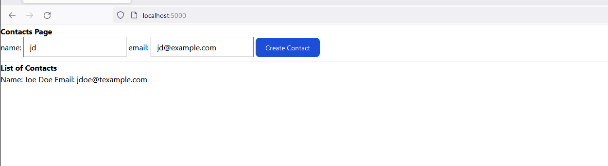

# Step 2 

    - Build a form with a `name` and `email` and sumbit a button.
    - Build a display list of names and emails (contacts) 

## Build a Contact Agent to represent the conctacts
Remember an Agent is a background process (Elixir Process) that maintain the state. 
and for the example is just enough.


```elixir
defmodule  HdaHtmx.Contacs do
  use Agent

  def start_link(init) do
    Agent.start_link(fn -> init end, name: __MODULE__)
  end

  def contacts do
    Agent.get(__MODULE__, & &1)
  end

  def add(item) do
    Agent.update(__MODULE__, &([item |&1]))
  end

end
```

Add it to the `Application.start` function.

## Let's start building a form with `name` and `email`

Create a template file named `_form.html.heex` located under the `page_html` folder.

```HTML
<form 
    hx-post={~p/contacts"}
    >
    name: <input type="text" name="name" placeholder="Name" />
    email: <input type="email" name="email"  placeholder="Email"/>   
    <button 
        name="_csrf_token"
        type="hidden"
        value={get_csrf_token()}
        type="Submit">Create Contact</button>
</form>
```

## Build the display list of contacts template.

Create a template file `_display.html.heex` 

 ```html       
 <div  id="contacts" style="display: flex; flex-direction: column" :for={item <- @contacts}>
    <div>
       Name: <span> <%= item.name %> </span>
       Email:<span> <%= item.email %> </span>
    </div>   
</div>
```

## Update the home template to include the form and display templates

```html
  <body class="bg-white antialiased">
    <h1><strong>Contacts Page</strong></h1>
    <div>
        <._form/>
    </div>    

    <hr/>
    <h1><strong>List of Contacts</strong></h1>
    <div>
      <._display contacts={@contacts}/>
    </div>    
  </body>

```

## Update our Router.
We need to add new handler for the `POST /contatcs`
```elixir
 post "/contacts", PageController, :contact
 ```

## Update our PageController as follow

```elixir

  def home(conn, _params) do
    contacts = HdaHtmx.Contacts.contacts()
    render(conn, :home, contacts: contacts)
  end


  def contact(conn, _params) do
    # retrieve the values from the form.
    name = params["name"]
    email = params["email"]

    HdaHtmx.Contacts.add(%{name: name, email: email})

    contacts = HdaHtmx.Contacts.contacts()
     # Redirect or render a template when you're done
    conn
     |> render(:home, contacts: contacts)
  end
  ```
In the function `home` we load the current contacts.
The function `contact`, 

If you launch your server you will see sometheing like this



Initially it display the predefined contacts, that's ok. But when we create a new contact, our page 
doesn't look right, and we are having the same issue as before.

When we create a new Contact we send a POST request to the /contacts endpoint. The server add the contact
to existing contacts and send back a response, but it send a full HTML as response and `hx-post` will
replace the innerHTML.


## Solution

  - Add a target to the form
  - hx-target="body"

This will fix the issue but we are still sending the full HTML as a response. 
And it's even worse every time we create a new contact, the payload is getting bigger. 


  - Add an id to the display fragment.

  ```html
  <div id="contacts" style="display: flex; flex-direction: column" :for={item <- @contacts}>
    <div>
       Name: <span> <%= item.name %> </span>
       Email:<span> <%= item.email %> </span>
    </div>   
</div>
```

 -  hx-target="#contacts"
 -  Udpdate the controller function to render the _display fragment template instead of the home template.

```elixir
 def contact(conn, params) do
    # retrieve the values from the form.
    name = params["name"]
    email = params["email"]

    HdaHtmx.Contacts.add(%{name: name, email: email})

    contacts = HdaHtmx.Contacts.contacts()
     # Redirect or render a template when you're done
    conn
     |> render(:_display, contacts: contacts)
  end
  ```

  This fix the issue, but the problem is that we are return the full list of contacts.


