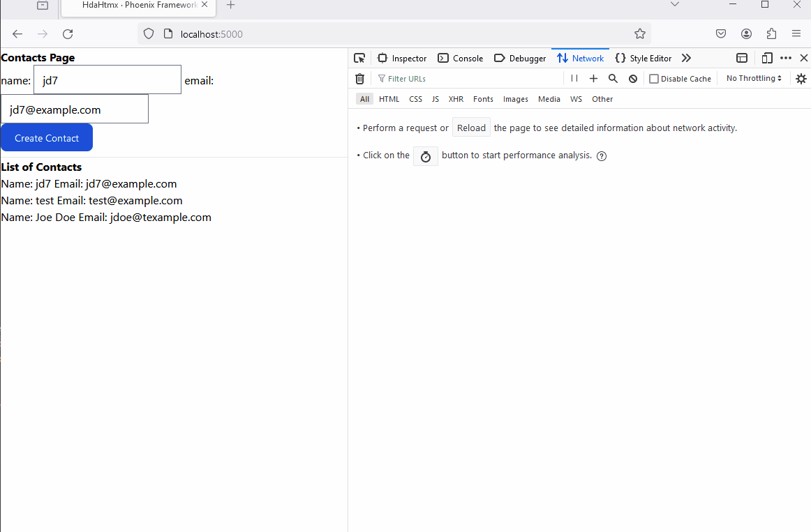
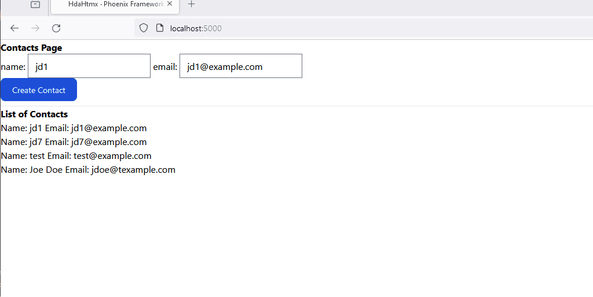

# Step 2 

    - Build a form with a `name` and `email` and sumbit a button.
    - Build a display list of names and emails (contacts) 

## Build a Contact Agent to represent the conctacts
Remember an Agent is a background process (Elixir Process) that maintain the state. 
and for the example is just enough.


```elixir
defmodule  HdaHtmx.Contacs do
  use Agent

  def start_link(init) do
    Agent.start_link(fn -> init end, name: __MODULE__)
  end

  def contacts do
    Agent.get(__MODULE__, & &1)
  end

  def add(item) do
    Agent.update(__MODULE__, &([item |&1]))
  end

end
```

Add it to the `Application.start` function.

## Let's start building a form with `name` and `email`

Create a template file named `_form.html.heex` located under the `page_html` folder.

```HTML
<form 
    hx-post={~p/contacts"}
    >
    name: <input type="text" name="name" placeholder="Name" />
    email: <input type="email" name="email"  placeholder="Email"/>   
    <button 
        name="_csrf_token"
        type="hidden"
        value={get_csrf_token()}
        type="Submit">Create Contact</button>
</form>
```

## Build the display list of contacts template.

Create a template file `_display.html.heex` 

 ```html       
 <div  id="contacts" style="display: flex; flex-direction: column" :for={item <- @contacts}>
    <div>
       Name: <span> <%= item.name %> </span>
       Email:<span> <%= item.email %> </span>
    </div>   
</div>
```

## Update the home template to include the form and display templates

```html
  <body class="bg-white antialiased">
    <h1><strong>Contacts Page</strong></h1>
    <div>
        <._form/>
    </div>    

    <hr/>
    <h1><strong>List of Contacts</strong></h1>
    <div>
      <._display contacts={@contacts}/>
    </div>    
  </body>

```

## Update our Router.
We need to add new handler for the `POST /contatcs`
```elixir
 post "/contacts", PageController, :contact
 ```

## Update our PageController as follow

```elixir

  def home(conn, _params) do
    contacts = HdaHtmx.Contacts.contacts()
    render(conn, :home, contacts: contacts)
  end


  def contact(conn, _params) do
    # retrieve the values from the form.
    name = params["name"]
    email = params["email"]

    HdaHtmx.Contacts.add(%{name: name, email: email})

    contacts = HdaHtmx.Contacts.contacts()
     # Redirect or render a template when you're done
    conn
     |> render(:home, contacts: contacts)
  end
  ```
In the function `home` we load the current contacts.
The function `contact`, 

If you launch your server you will see sometheing like this


Initially it display the predefined contacts, that's ok. But when we create a new contact, our page 
doesn't look right, and we are having the same issue as before [htmx-swap](https://htmx.org/docs/#swapping).

When we create a new Contact we send a POST request to the /contacts endpoint. The server add the contact
to existing contacts and send back a response, but it send a full HTML as response and `hx-post` will
replace the innerHTML.


## Solution

  - Add a target to the form
  - hx-target="body"

This will fix the issue but we are still sending the full HTML as a response. 
And it's even worse every time we create a new contact, the payload is getting bigger. 


  - Add an id to the display fragment.

  ```html
  <div id="contacts" style="display: flex; flex-direction: column" :for={item <- @contacts}>
    <div>
       Name: <span> <%= item.name %> </span>
       Email:<span> <%= item.email %> </span>
    </div>   
</div>
```

 -  hx-target="#contacts"
 -  Udpdate the controller function to render the _display fragment template instead of the home template.

```elixir
 def contact(conn, params) do
    # retrieve the values from the form.
    name = params["name"]
    email = params["email"]

    HdaHtmx.Contacts.add(%{name: name, email: email})

    contacts = HdaHtmx.Contacts.contacts()
     # Redirect or render a template when you're done
    conn
     |> render(:_display, contacts: contacts)
  end
  ```

  This fix the issue, but the problem is that we are return the full list of contacts.
  Still we have a few issues. 
    - Duplicated content -> no error handling, use 400 status for bad request and display errors in the form
    - Not send everything when we create a new contact.


We update our controller to check for duplicate emails, if you we create a map with values {name, email}
and errors.

```elixir
 def contact(conn, params) do
    # retrieve the values from the form.
    name = params["name"]
    email = params["email"]

    contacts = HdaHtmx.Contacts.contacts()

    case  Enum.any?(contacts, fn item -> item.email === email end) do
      true ->
        values = %{name: name, email: email}
        errors = %{email: "Email already exist"}
        conn
        |> put_status(:bad_request)
        |> render(:_form, values: values, errors: errors)

      _ ->
        id = Enum.count(HdaHtmx.Contacts.contacts())
        HdaHtmx.Contacts.add(%{name: name, email: email, id: id})
        contacts = HdaHtmx.Contacts.contacts()
        # Redirect or render a template when you're done
       conn
        |> render(:_display, contacts: contacts)
    end

  end
  ```


We update the form template and the home template since now we need to pass a map with the values and errors.

```html
<form 
    hx-post={~p"/contacts"}
    hx-target="#contacts"
  >
    name: <input :if={@values.name} value={@values.name} type="text" name="name" placeholder="Name" required/>
    email: <input :if={@values.email} value={@values.email} type="email" name="email" placeholder="Email" required/>   
    <%=if @errors do %>
        <div style="color: read"><%=@errors.email%></div>
    <% end %>
    <button 
        name="_csrf_token"
        type="hidden"
        value={get_csrf_token()}
        type="Submit"
        class="text-white bg-blue-700 hover:bg-blue-800 
               focus:ring-4 focus:ring-blue-300 
               font-medium rounded-lg text-sm 
               px-5 py-2.5 me-2 mb-2 dark:bg-blue-600 
               dark:hover:bg-blue-700 focus:outline-none 
               dark:focus:ring-blue-800"> 
        Create Contact
    </button>
</form>
```

With the current changes we got 400 response, but the page doesn't display the changes.

By default a Response with status 400 is not displayed by htmx, it trigger an event
the [htmx:responseError](https://htmx.org/events/#htmx:responseError)




Adding the following event Handling 


```Javascript
<script>
      document.addEventListener("DOMContentLoaded", (event) => {
        document.body.addEventListener('htmx:beforeSwap', function(evt) {
          if (evt.detail.xhr.status === 422) {
            // allow 422 responses to swap as we are using this a singal
            // a for was submitted with bad data and want to rerender
            // errors
            evt.detail.shouldSwap = true;
            evt.detail.isError = false; 
          }
        });
      })
    </script>  
```

we need also update the controller

|> put_status(:unprocessable_entity )

and now the code works as it should.



But now when we create a good contact the form goes away.

## Solution
    - Out of band updates (https://htmx.org/docs/#oob_swaps)

